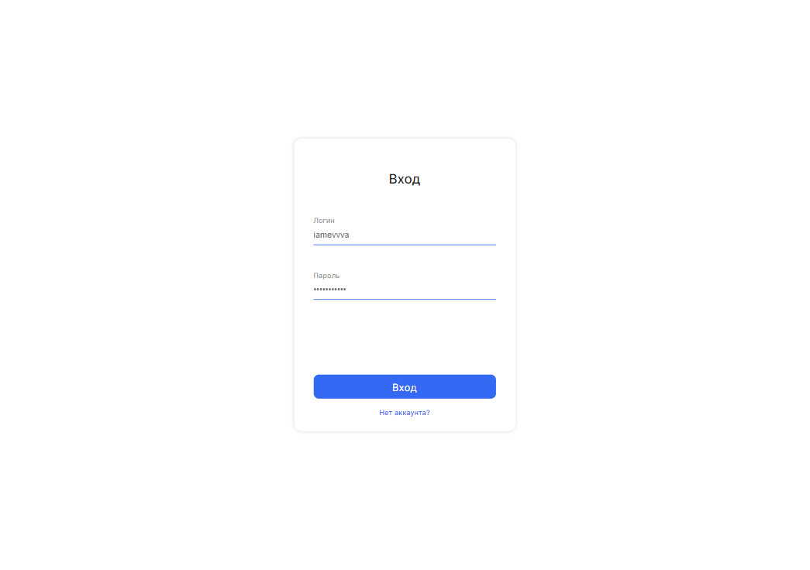
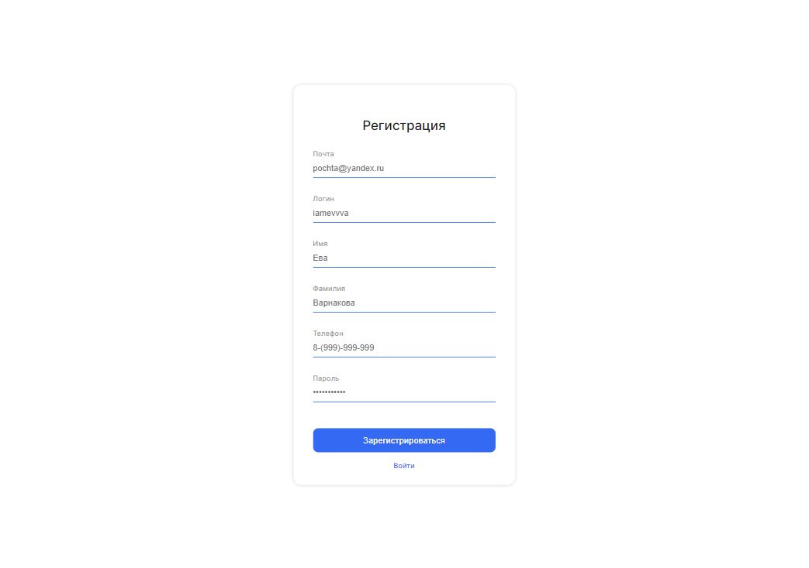
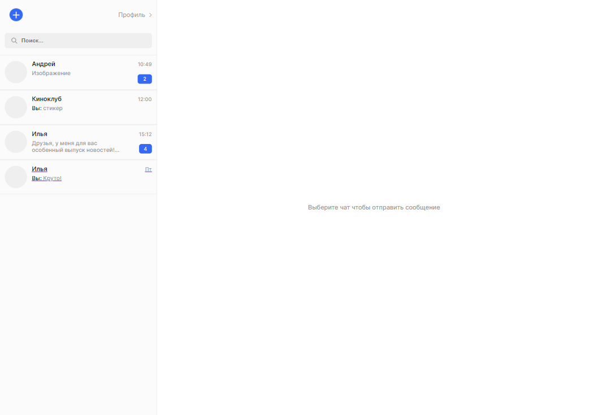
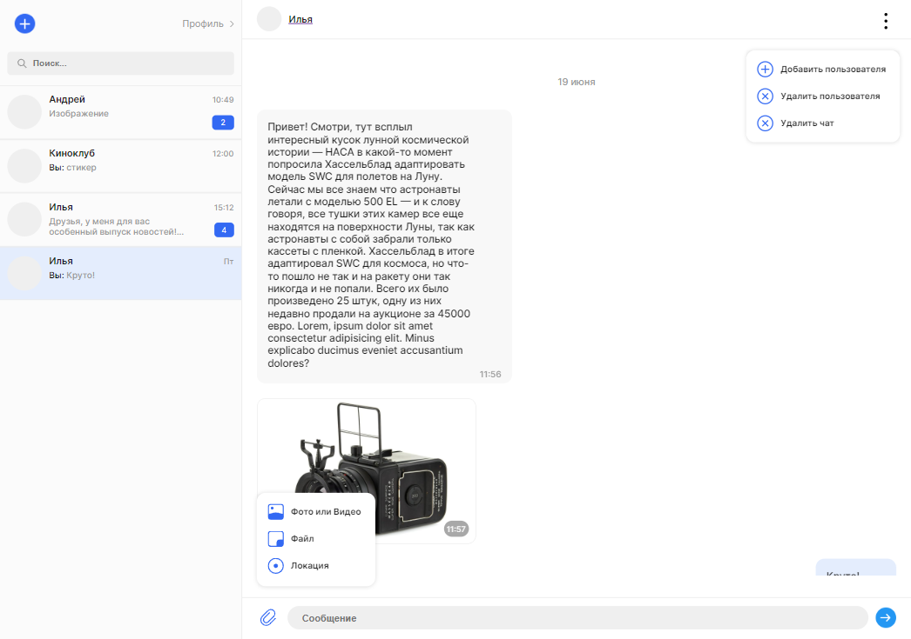
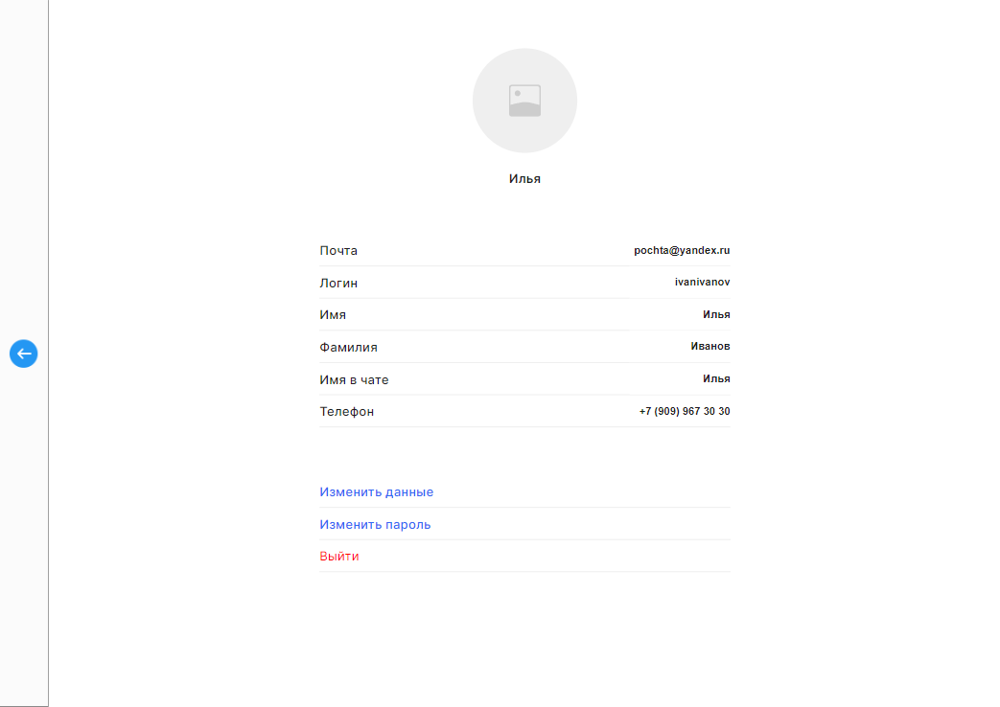

# Веб-приложение "Чат"

Проект **_Веб-приложение "Чат"_** представляет собой приложение, основанное на **_WebSocket_**, которые обеспечивают реально-временную связь между пользователями, сборка проекта происходила при помощи  **_Webpack_** ( В начале использовал **_Parcel_** ).

Реализован базововый **_класс Block (+ кастомный роутер)_**, который нужен для создания компонентов с **_реактивным_** подходом. В приложении использовался **_шаблонизатор Handlebars_**, который позволяет генерировать **_динамический HTML-код на основе шаблонов_**.

Были разработаны и реализованы **_юнит-тесты_**: **Mocha + Chai**.

В проекте был использован **Docker** для упаковки и развертывания приложения в изолированной и надежной контейнерной среде.

Для обеспечения **эффективной коммуникации** между компонентами был использован **EventBus (шина событий)**.

Проект реализован на архитектуре **MVC (Model-View-Controller)**.

- Ссылка на прототип проекта находится в [Figma](<https://www.figma.com/file/zdz0Xx0vvfUfVxJAtP5cyw/Chat_external_link-(Copy)?type=design&node-id=1-2&t=PXivSqJXneHc7oUe-0>)

- Ссылка для просмотра проекта на хостинге [Netlify](https://tangerine-cupcake-6bdf48.netlify.app/)

- **_Контейнер_** с проектом был развернут на хостинге [Render](https://chat-m5m2.onrender.com)

## Установка

---

Ниже приведены скрипты, которые можно использовать для запуска проекта:

- `npm install` — установка стабильной версии,
- `npm run start` — запуск версии для разработчика,
- `npm run build` — сборка стабильной версии.
- `npm run server` — запуск сервера со статикой.
- `npm run test` — запуск **юнит-тестов**.
- `npm run lint` — запуск **eslint** и **stylelint**.

## Примеры использования

1. При запуске проекта вам откроется экран **авторизации/регистрации**. Переход между ними осуществляется с помощью ссылок **_Нет аккаунта?/Войти_**.
2. Создайте аккаунт, чтобы зайти в чат, если он у вас уже есть, заполните поля логина и пароля и **_нажмите на кнопку Вход_**.

  
  

4. Теперь вы на главной странице. Чтобы **_создать чат_** нужно **_нажать на плюс в левом верхнем углу_**. После создания чата, в правом верхнем углу можно:
   
   - _Добавить/удалить пользователей_
   - _Удалить чат_
   - _Изменить аватар чата_

  
1. Для просмотра настройки пользователя **_требуется нажать на Профиль сверху_**, после вас перебросит на **_страницу настроек_**. В которой можно:
   - _Изменить аватар_
   - _Изменить данные о пользователе_
   - _Изменить пароль_
   - _Выйти из аккаунта_

  
  
